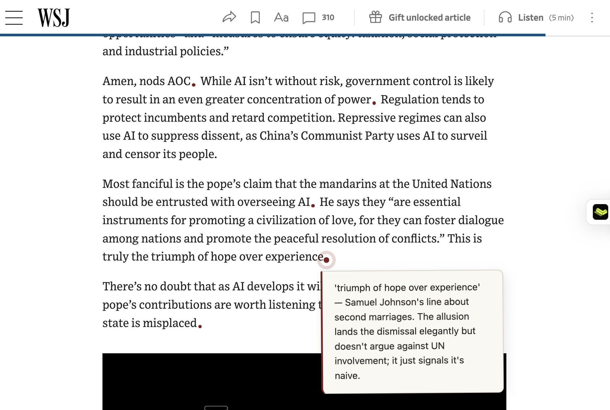
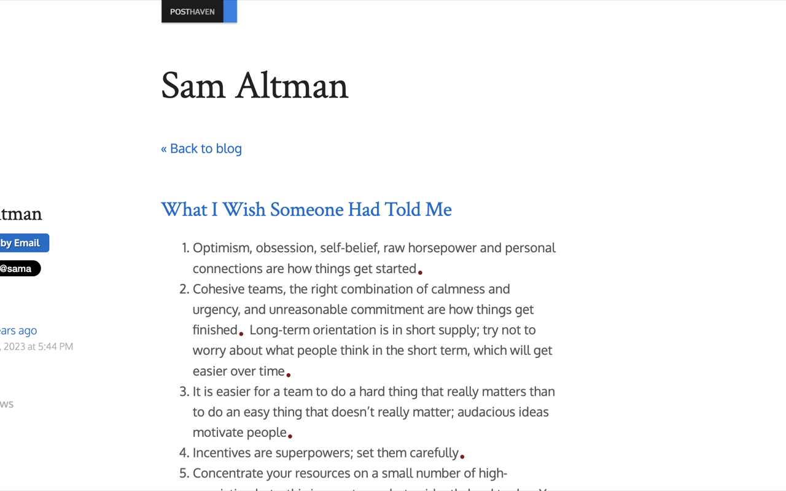

<p align="center">
  
</p>

<h1 align="center">Jeom</h1>

<p align="center"><strong>AI margin notes for serious readers.</strong></p>

<p align="center">
  A Chrome extension that leaves the article intact and adds a small burgundy dot
  wherever a sentence deserves a second look. Hover the dot for a compact note.
</p>

<p align="center">
  <a href="#install-from-source">Install from source</a> ·
  <a href="#privacy">Privacy</a> ·
  <a href="LICENSE">Apache-2.0</a>
</p>



Jeom is for readers who want to stay with a text—not skim around it. It adds
context, allusions, and gentle interpretive prompts at the sentence level,
without turning the article into a summary or a separate reading surface. In
the example above, the note unpacks a Samuel Johnson allusion without pulling
the reader out of the argument.

## The interaction



1. Open a long-form article and click Jeom in the toolbar.
2. Jeom finds the article body and identifies sentences worth pausing on.
3. Small burgundy dots replace those sentence-ending periods. Hover one to read
   a note, then keep reading.

The interface is deliberately quiet: the original typography, layout, and
reading rhythm remain in charge.

## Built around your own model

Jeom is BYOK (bring your own key). Choose Anthropic, OpenAI, or Anthropic via
Azure AI Foundry in the Options page; the extension sends article text only to
the provider you select. Your API key is stored locally in Chrome, not on a
Jeom server.

## Install from source

Jeom is currently an experimental source install. You will need Chrome and
either [Bun](https://bun.sh) or npm.

```bash
git clone https://github.com/lminsl/jeom.git
cd jeom/extension
bun install                 # or: npm install
bun run build               # or: npm run build
```

Then:

1. Visit `chrome://extensions`.
2. Turn on **Developer mode**.
3. Choose **Load unpacked** and select `jeom/extension/dist`.
4. Open Jeom’s **Settings** from its toolbar menu, choose a provider and model,
   enter your API key, and save.
5. Visit a long-form article and click the Jeom toolbar icon.

Jeom works best on article pages, essays, and blog posts. It intentionally
declines homepages, listing pages, log-in walls, and pages without a clear
article body.

## Privacy

Your API key stays in `chrome.storage.local` and is sent only to the LLM
provider you select. Optional diagnostic sharing is **off by default**; if you
turn it on, Jeom may send page and rendering diagnostics to help improve
article selection and notes. It never sends your API key. See
[PRIVACY.md](PRIVACY.md) for the complete policy.

## Develop

```bash
cd extension
bun run test
bun run build
```

The extension is TypeScript + Vite, packaged as a Manifest V3 Chrome
extension. The sentence segmentation, article-root selection, LLM clients,
and marker UI all have focused tests alongside their source.

## Contributing

Bug reports, reading-edge cases, and interface ideas are welcome. Please read
[CONTRIBUTING.md](CONTRIBUTING.md) before opening a pull request.

## License

Licensed under [Apache-2.0](LICENSE).
